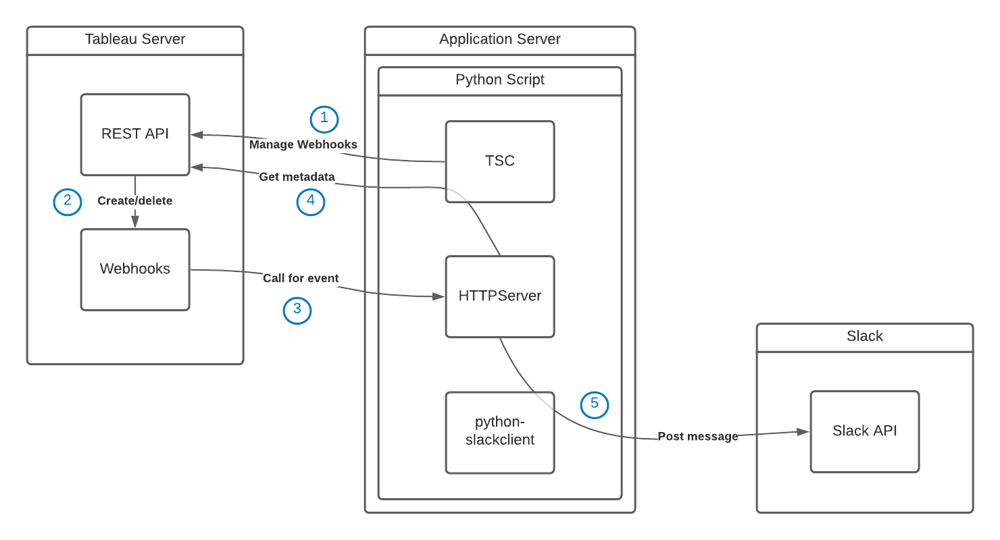

# tableau-server-webhooks-to-slack
This aptly named application is a small server-side Python script that will:

* Create a webhook for you on Tableau Server, for any of the available events
* Listen to said webhook
* When the event occurs, capture the relevant information and post that to Slack

## Architecture

### Components

We're using just a few simple components:

* [Tableau Server Client (TSC)](https://github.com/tableau/server-client-python) is going to communicate with the Tableau Server REST API to set up (and later remove) the webhook. It's also going to fetch metadata and a preview image of the workbook at hand.
* [HTTPServer](https://docs.python.org/3/library/http.server.html) is going to be the lightweight web server that listens to the events from the webhook. It's going to be wrapped in an `ssl` socket according to [these instructions](https://blog.anvileight.com/posts/simple-python-http-server/).
* [python-slackclient](https://github.com/slackapi/python-slackclient): some Slack library we used before. Really easy interface to the Slack API which we'll use to post messages.

### Flow

* Get credentials from the appropriate source (see below).
* Log in to Tableau Server REST API with PAT (diagram, step 1).
* Create webhook with name, event, URL (diagram, step 2).
* Spin up the "listener web server" that listens to said URL, forever (diagram, HTTPServer component).
  * This HTTP Server has a request handler function to receive and process requests from Tableau Server's webhook (diagram, step 3).
  * It then also takes care of fetching additional metadata for the workbook (diagram, step 4), and ...
  * ... of posting to Slack when we have everything (diagram, step 5).
* When the script is terminated with a KeyboardInterrupt, delete the webhook we created previously.

## Authentication

We're authenticating against two services or platforms: Tableau Server and Slack. There are three methods of providing the necessary credentials; or rather, tokens. These are:

* As a command line argument. If these are specified, they will take precedence over environment variables. The arguments are:
  * `--pat-name`: Tableau Server Personal Access Token Name for the Tableau Server REST API. See REST API Authentication.
  * `--pat-secret`: Tableau Server Personal Access Token Secret.
  * `--slack-token`: The token for your Slack application (or rather, bot), that has permissions to write and upload to that channel.
* Alternatively, the arguments for the tokens may be omitted from the command line, in which case the script will look for these environment variables (in the same order). To specify these, use the appropriate syntax for your operating system. Consider `export` when using a virtualenv. The variable names:
  * `TS_PAT_NAME`
  * `TS_PAT_SECRET`
  * `SLACK_TOKEN`  
* If neither of the two methods above are used, the script will prompt for the required information.

## Usage

* This can be run interactively, or probably also [registered as a service](https://blog.frd.mn/how-to-set-up-proper-startstop-services-ubuntu-debian-mac-windows/) though we'd want to verify whether it cleans up the previously created webhook properly. Probably not.
* To run on port 443 with a virtualenv: `sudo ./.venv/bin/python tableau_server_webhooks_to_slack.py <arguments>`. This is because in Linux, non-root processes are not allowed to bind to port 443.
* As a service with systemd, which is ideal... following [these instructions](https://tecadmin.net/setup-autorun-python-script-using-systemd/).
  * We'll just save the `.service` file to GitHub, in our application directory, and symlink it in `/lib/systemd/system/`.
  * Start, stop, status with `sudo systemctl start tableau-server-webhooks-to-slack.service`.
  * View logs with `sudo journalctl -e -u tableau-server-webhooks-to-slack.service`.